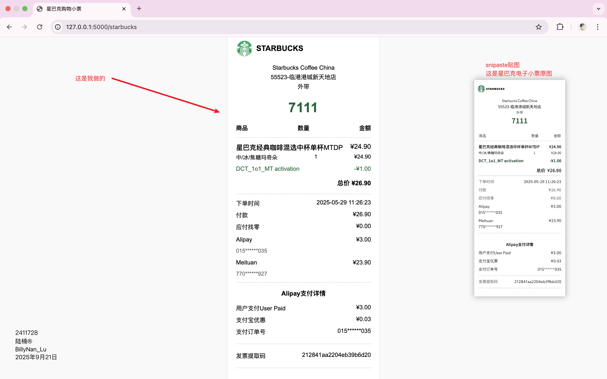
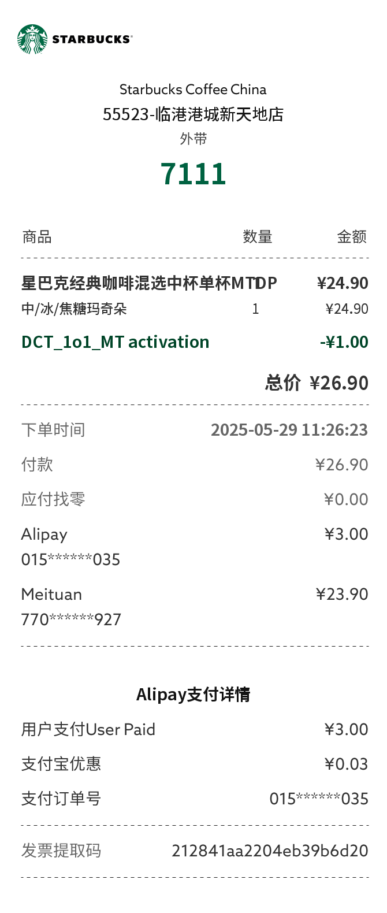

## Web应用开发平时作业1

所有代码必须使用Python语言和Flask框架完成

1. 收集一张真实的纸质小票、收据🧾、外卖单据等等（不限来源），利用ai工具转换成一个大致相同html网页模版。
2. 创建一个路由能够成功访问到该模版文件。
3. 将此模版中的静态资源比如图片，css样式表，js代码分离到本地文件中，并能成功引入加载到模版中。
4. 修改模版并模拟生成模版小票中的数据，比如 订单号，取餐码，名称，价格等等信息，并将该信息，通过传递变量方式，正确地将这些数据在模版中显示。**注意**修改后的模版中必须包含一个选择结构和一个循环结构。
5. 对于明显的需要通过计算的数据，比如总价等，应通过计算相应数据生成。
6. 在浏览器中运行成功后，拍照、截图或者录屏

### 请上传小票照片、所有相关代码文件和运行成功的截图。
GitHub代码仓库地址：https://github.com/BillyNanLu/PythonWebFlask

### 运行截图



### 小票原图



### 代码

仓库中week2下的assignments

```python
from flask import Flask, render_template, flash, redirect, session, request, url_for

app = Flask(__name__,template_folder='templates')

@app.route('/starbucks')
def starbucks():
    store_info = {
        "store_no": "55523",
        "store_name": "临港港城新天地店"
    }
    order = {
        "order_number" : "7111",
        "product_price": 24.90,
        "discount_price": 1.00,
        "DP_method": "Meituan",
        "DP_code": "770******927",
        "product_name" : ["星巴克经典咖啡混选中杯单杯MTDP", ""],
        "product_details": ["中/冰/焦糖玛奇朵", "1"],
        "discount_details": ["DCT_1o1_MT activation", ""],
        "order_time": "2025-05-29 11:26:23",
        "invoice_code": "212841aa2204eb39b6d20"
    }
    payment = {
        "payment_method": "Alipay",
        "payment_code": "015******035",
        "payment_money": 3.00,
        "payment_discount": ["支付宝优惠", "¥0.03"]
    }

    return render_template(
        "Starbucks.html",
        **store_info,
        **order,
        **payment
    )

if __name__ == '__main__':
    app.run(debug=True, port=5000)
```

```html
<!DOCTYPE html>
<html lang="zh-CN">
<head>
    <meta charset="UTF-8">
    <meta name="viewport" content="width=device-width, initial-scale=1.0">
    <title>星巴克购物小票</title>
    <link rel="stylesheet" href="{{url_for('static', filename='css/Starbucks.css')}}">

</head>
<body>
    <div class="receipt">
        <div class="logo">
            
            <span>STARBUCKS</span>
        </div>

        <div class="store-info">
            <p>Starbucks Coffee China</p>
            <p>{{store_no}}-{{store_name}}</p>
            <p>外带</p>
        </div>

        <div class="order-number">{{order_number}}</div>

        <div class="header-row">
            <div class="header-item">商品</div>
            <div class="header-item">数量</div>
            <div class="header-item">金额</div>
        </div>

        <hr class="separator">

        <div class="product">
            <div class="product-name">
                
                    <div>{{product_name}}</div>
                
                <div>¥{{ "%.2f" | format(product_price) }}</div>
            </div>
            <div class="product-details">
                
                    <div>{{product_details}}</div>
                
                <div>¥{{ "%.2f" | format(product_price) }}</div>
            </div>
        </div>

        <div class="discount">
            
                
                    <div>{{discount_details}}</div>
                
                <div>-¥{{"%.2f" | format(discount_price) }}</div>
            
            
        </div>

        <div class="total">总价 ¥{{ "%.2f" | format(product_price - discount_price + payment_money) }}</div>

        <hr class="separator">

        <div class="info-row">
            <div>下单时间</div>
            <div>{{order_time}}</div>
        </div>

        <div class="info-row">
            <div>付款</div>
            <div>¥{{ "%.2f" | format(product_price - discount_price + payment_money) }}</div>
        </div>

        <div class="info-row">
            <div>应付找零</div>
            <div>¥0.00</div>
        </div>

        <div class="payment-method">
            <div class="info-row">
                <div class="payment-method-name">{{payment_method}}</div>
                <div class="payment-amount">¥{{ "%.2f" | format(payment_money) }}</div>
            </div>
            <div class="payment-method-number">{{payment_code}}</div>
        </div>

        <div class="payment-method">
            <div class="info-row">
                <div class="payment-method-name">{{DP_method}}</div>
                <div class="payment-amount">¥{{ "%.2f" | format(product_price - discount_price) }}</div>
            </div>
            <div class="payment-method-number">{{DP_code}}</div>
        </div>

        <hr class="separator">

        <div class="payment-details">
            <h3>{{payment_method}}支付详情</h3>

            <div class="info-row">
                <div>用户支付User Paid</div>
                <div>¥{{ "%.2f" | format(payment_money) }}</div>
            </div>

            <div class="info-row">
                
                    
                        <div>{{payment_discount}}</div>
                    
                
                
            </div>

            <div class="info-row">
                <div>支付订单号</div>
                <div>{{payment_code}}</div>
            </div>
        </div>

        <hr class="final-separator">

        <div class="info-row">
            <div>发票提取码</div>
            <div>{{invoice_code}}</div>
        </div>

        <hr class="final-separator">
    </div>
</body>
</html>
```

```css
body {
    font-family: "Arial", "SimHei", sans-serif;
    margin: 0 auto;
    padding: 20px;
    background-color: #f9f9f9;
}

.receipt {
    width: 320px;
    margin: 0 auto;
    background-color: white;
    padding: 25px 20px;
    box-shadow: 0 1px 3px rgba(0,0,0,0.1);
}

.logo {
    display: flex;
    align-items: center;
    margin-bottom: 15px;
}

.logo img {
    width: 40px;
    height: 40px;
    margin-right: 8px;
}

.logo span {
    font-size: 18px;
    font-weight: bold;
}

.store-info {
    text-align: center;
    margin-bottom: 20px;
    line-height: 1.6;
}

.store-info p {
    margin: 0;
    font-size: 14px;
}

.order-number {
    text-align: center;
    font-size: 32px;
    font-weight: bold;
    color: #006633;
    margin: 20px 0;
    letter-spacing: 1px;
}

.separator {
    border: none;
    border-top: 1px dashed #ccc;
    margin: 12px 0;
}

.header-row {
    display: flex;
    justify-content: space-between;
    font-size: 14px;
    margin-bottom: 5px;
}

.header-item {
    font-weight: bold;
}

.product {
    margin: 10px 0;
}

.product-name {
    font-weight: 500;
    margin-bottom: 3px;
    display: flex;
    justify-content: space-between;
}

.product-details {
    font-size: 13px;
    margin-bottom: 5px;
    display: flex;
    justify-content: space-between;
}

.discount {
    color: #006633;
    font-size: 14px;
    margin: 8px 0;
    display: flex;
    justify-content: space-between;
}

.total {
    font-size: 15px;
    font-weight: bold;
    text-align: right;
    margin: 15px 0;
}

.info-row {
    display: flex;
    justify-content: space-between;
    margin: 8px 0;
    font-size: 14px;
}

.payment-method {
    margin: 12px 0;
}

.payment-method-name {
    font-size: 14px;
    margin-bottom: 3px;
}

.payment-method-number {
    font-size: 13px;
    color: #666;
    margin-bottom: 3px;
}

.payment-amount {
    text-align: right;
    font-size: 14px;
}

.payment-details {
    margin-top: 15px;
}

.payment-details h3 {
    font-size: 15px;
    text-align: center;
    margin: 15px 0;
    font-weight: 600;
}

.invoice-code {
    font-size: 14px;
    margin: 15px 0;
}

.final-separator {
    border: none;
    border-top: 1px dashed #ccc;
    margin: 18px 0;
}
```
