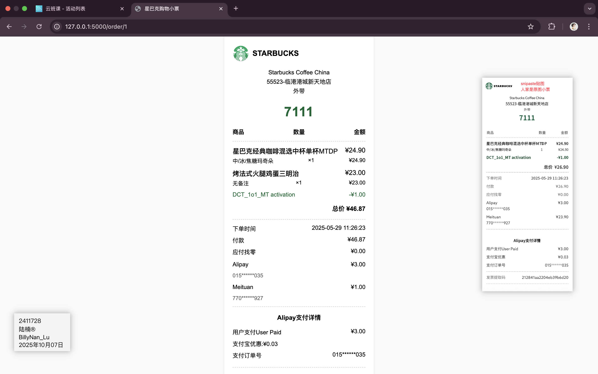
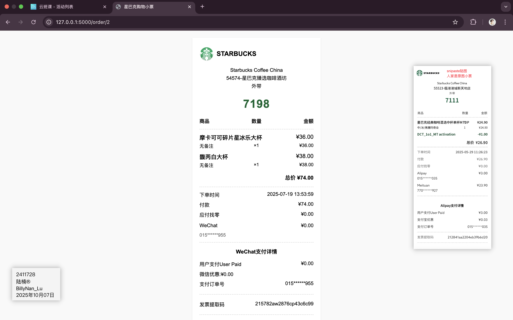
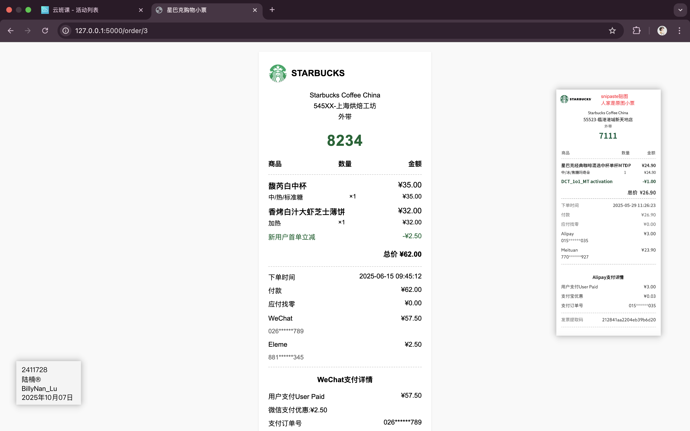
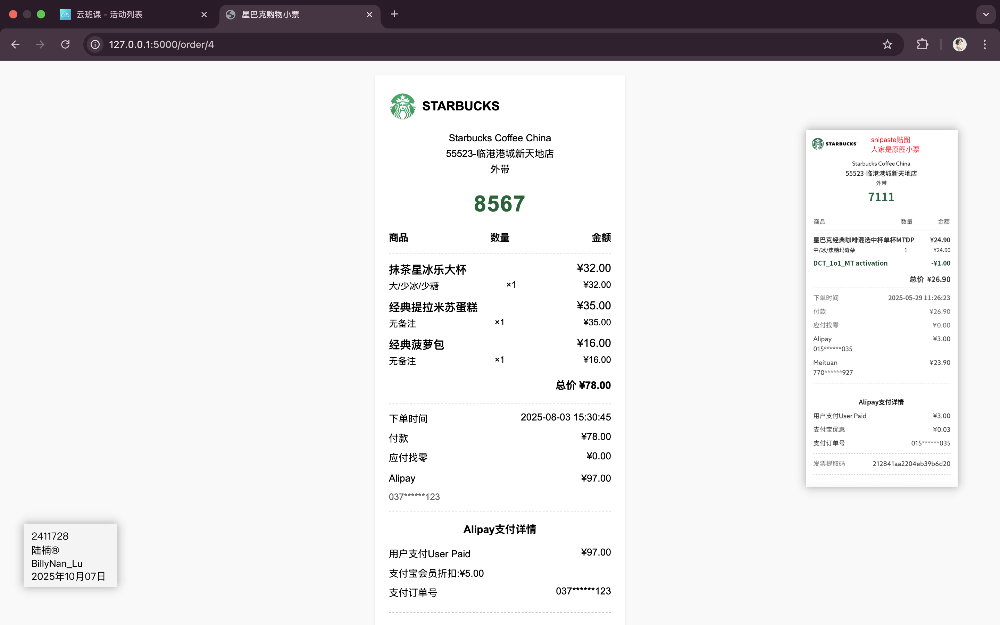
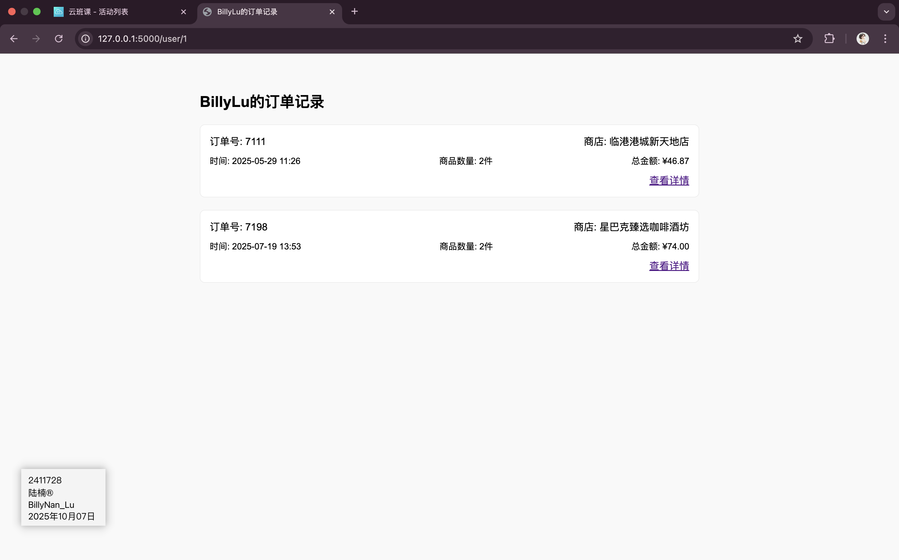
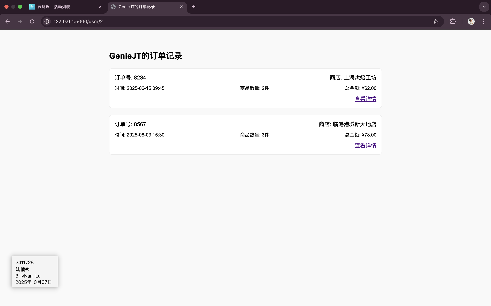

## Web应用开发平时作业2

**所有代码必须使用Python语言和Flask框架完成**

在作业1的基础上修改代码，完成以下需求

1. 需要在浏览器中通过路由` /order/<order_id>`访问到订单小票页面。

2. 所有的数据需要从sqlite数据库中读取（不允许使用任何其他类型的数据库）。

3. 小票中的购买品项部分需要多于一种。如果作业1中只有一个品项，自行生成额外的数据，不用重新更换新的小票。

4. 添加一个路由 `/user/<user_id>`,需要通过该路由访问此user_id用户的所有订单小票。该页面需要显示多于一张订单小票。

   **注意**

   自行考虑数据库表结构，model等如何设计，完成功能即可。

   可以不使用任何orm框架，需要提交建表的sql文件。

   可以修改前端页面，跟实际越接近越好。

### 请上传作业1中相同的小票照片、所有相关代码文件（包括数据库文件，不要上传python虚拟环境文件）和运行成功的截图或视频。

GitHub代码仓库地址：https://github.com/BillyNanLu/PythonWebFlask

对应的作业代码地址：https://github.com/BillyNanLu/PythonWebFlask/tree/main/week4/assignments

### 运行截图

具体可以看附件运行视频！














### 代码

GitHub代码仓库地址：https://github.com/BillyNanLu/PythonWebFlask/tree/main/week4/assignments

数据库文件(schema.sql)

```sqlite
-- 创建用户表
CREATE TABLE users (
    id INTEGER PRIMARY KEY AUTOINCREMENT,
    name TEXT NOT NULL,
    created_at TIMESTAMP DEFAULT CURRENT_TIMESTAMP
);

-- 创建商店表
CREATE TABLE stores (
    id INTEGER PRIMARY KEY AUTOINCREMENT,
    store_no TEXT NOT NULL,
    store_name TEXT NOT NULL,
    address TEXT
);

-- 创建产品表
CREATE TABLE products (
    id INTEGER PRIMARY KEY AUTOINCREMENT,
    name TEXT NOT NULL,
    base_price REAL NOT NULL,
    description TEXT
);

-- 创建订单表
CREATE TABLE orders (
    id INTEGER PRIMARY KEY AUTOINCREMENT,
    order_number TEXT NOT NULL UNIQUE,
    user_id INTEGER NOT NULL,
    store_id INTEGER NOT NULL,
    order_time TIMESTAMP NOT NULL,
    invoice_code TEXT,
    FOREIGN KEY (user_id) REFERENCES users (id),
    FOREIGN KEY (store_id) REFERENCES stores (id)
);

-- 创建订单项表
CREATE TABLE order_items (
    id INTEGER PRIMARY KEY AUTOINCREMENT,
    order_id INTEGER NOT NULL,
    product_id INTEGER NOT NULL,
    quantity INTEGER NOT NULL DEFAULT 1,
    details TEXT,
    FOREIGN KEY (order_id) REFERENCES orders (id),
    FOREIGN KEY (product_id) REFERENCES products (id)
);

-- DP
CREATE TABLE dp (
    id INTEGER PRIMARY KEY AUTOINCREMENT,
    order_id INTEGER NOT NULL,
    method TEXT NOT NULL,
    code TEXT,
    amount REAL,
    details TEXT,
    FOREIGN KEY (order_id) REFERENCES orders (id)
);

-- 创建支付表
CREATE TABLE payments (
    id INTEGER PRIMARY KEY AUTOINCREMENT,
    order_id INTEGER NOT NULL,
    method TEXT NOT NULL,
    code TEXT,
    amount REAL DEFAULT 0.00,
    discount_price REAL,
    discount_details TEXT,
    FOREIGN KEY (order_id) REFERENCES orders (id)
);


-- 插入示例数据
INSERT INTO users (name) VALUES ('BillyLu');
INSERT INTO users (name) VALUES ('GenieJT');

INSERT INTO stores (store_no, store_name, address)
VALUES ('55523', '临港港城新天地店', '上海市浦东新区茉莉路港城新天地225弄67号');
INSERT INTO stores (store_no, store_name, address)
VALUES ('54574', '星巴克臻选咖啡酒坊', '上海市黄浦区北京东路99号地上1楼L101A室');
INSERT INTO stores (store_no, store_name, address)
VALUES ('545XX', '上海烘焙工坊', '上海市静安区南京西路789号N110至N201单元');

INSERT INTO products (name, base_price, description) VALUES
('星巴克经典咖啡混选中杯单杯MTDP', 24.90, ''),
('星巴克星冰乐混选大杯单杯MTDP', 27.90, ''),
('焦糖玛奇朵中杯', 34.00, '经典咖啡'),
('焦糖玛奇朵大杯', 37.00, '经典咖啡'),
('馥芮白中杯', 35.00, '经典咖啡'),
('馥芮白大杯', 38.00, '经典咖啡'),
('摩卡大杯', 36.00, '经典咖啡'),
('摩卡中杯', 33.00, '经典咖啡'),
('美式咖啡中杯', 27.00, '经典咖啡'),
('美式咖啡大杯', 30.00, '经典咖啡'),
('椰子丝绒燕麦拿铁中杯', 36.00, '经典咖啡'),
('椰子丝绒燕麦拿铁大杯', 39.00, '经典咖啡'),
('海盐焦糖风味冰镇浓缩中杯', 36.00, '经典咖啡'),
('海盐焦糖风味冰镇浓缩大杯', 39.00, '经典咖啡'),
('抹茶星冰乐中杯', 29.00, '星冰乐'),
('抹茶星冰乐大杯', 32.00, '星冰乐'),
('摩卡可可碎片星冰乐中杯', 33.00, '星冰乐'),
('摩卡可可碎片星冰乐大杯', 36.00, '星冰乐'),
('巧克力风味星冰乐中杯', 29.00, '星冰乐'),
('巧克力风味星冰乐大杯', 32.00, '星冰乐'),
('冰摇红莓黑加仑茶中杯', 23.00, '冰摇茶'),
('冰摇红莓黑加仑茶大杯', 26.00, '冰摇茶'),
('冰摇桃桃乌龙茶中杯', 29.00, '冰摇茶'),
('冰摇桃桃乌龙茶大杯', 32.00, '冰摇茶'),
('焙茶拿铁中杯', 26.00, '茶拿铁'),
('焙茶拿铁大杯', 29.00, '茶拿铁'),
('抹茶拿铁中杯', 26.00, '茶拿铁'),
('抹茶拿铁大杯', 29.00, '茶拿铁'),
('红茶拿铁中杯', 26.00, '茶拿铁'),
('红茶拿铁大杯', 29.00, '茶拿铁'),
('香烤白汁大虾芝士薄饼', 32.00, '烘培&三明治'),
('滇香菌菇牛肉法棍三明治', 29.00, '烘培&三明治'),
('烤法式火腿鸡蛋三明治', 23.00, '烘培&三明治'),
('培根芝士蛋堡', 25.00, '烘培&三明治'),
('火腿芝士可颂', 23.00, '烘培&三明治'),
('经典菠萝包', 16.00, '烘培&三明治'),
('千粹抹茶生巧蛋糕', 36.00, '蛋糕'),
('经典提拉米苏蛋糕', 35.00, '蛋糕'),
('经典瑞士卷', 29.00, '蛋糕');


-- billy 1
INSERT INTO orders (order_number, user_id, store_id, order_time, invoice_code)
VALUES ('7111', 1, 1, '2025-05-29 11:26:23', '212841aa2204eb39b6d20');
INSERT INTO order_items (order_id, product_id, quantity, details)
VALUES (1, 1, 1, '中/冰/焦糖玛奇朵'),
       (1, 33, 1, '');
INSERT INTO dp (order_id, method, code, amount, details)
VALUES (1, 'Meituan', '770******927', 1.00, 'DCT_1o1_MT activation');
INSERT INTO payments (order_id, method, code, amount, discount_price, discount_details)
VALUES (1, 'Alipay', '015******035', 3.00, 0.03,'支付宝优惠:¥0.03');


-- billy 2
INSERT INTO orders (order_number, user_id, store_id, order_time, invoice_code)
VALUES ('7198', 1, 2, '2025-07-19 13:53:59', '215782aw2876cp43c6c99');
INSERT INTO order_items (order_id, product_id, quantity, details)
VALUES (2, 18, 1, ''),
       (2, 6, 1, '');
INSERT INTO payments (order_id, method, code, amount, discount_price, discount_details)
VALUES (2, 'WeChat', '015******955', 0.00, 0.00, '微信优惠:¥0.00');


-- GenieJT的订单1
INSERT INTO orders (order_number, user_id, store_id, order_time, invoice_code)
VALUES ('8234', 2, 3, '2025-06-15 09:45:12', '216395bc3789df56e7a12');
INSERT INTO order_items (order_id, product_id, quantity, details)
VALUES (3, 5, 1, '中/热/标准糖'),
       (3, 31, 1, '加热');
INSERT INTO dp (order_id, method, code, amount, details)
VALUES (3, 'Eleme', '881******345', 2.50, '新用户首单立减');
INSERT INTO payments (order_id, method, code, amount, discount_price, discount_details)
VALUES (3, 'WeChat', '026******789', 57.50, 2.50, '微信支付优惠:¥2.50');


-- GenieJT的订单2
INSERT INTO orders (order_number, user_id, store_id, order_time, invoice_code)
VALUES ('8567', 2, 1, '2025-08-03 15:30:45', '217842de4567fg89h0i1');
INSERT INTO order_items (order_id, product_id, quantity, details)
VALUES (4, 16, 1, '大/少冰/少糖'),
       (4, 38, 1, ''),
       (4, 36, 1, '');
INSERT INTO payments (order_id, method, code, amount, discount_price, discount_details)
VALUES (4, 'Alipay', '037******123', 97.00, 5.00, '支付宝会员折扣:¥5.00');
```

数据模型(models.py)

```python
from settings import db
from datetime import datetime


class User(db.Model):
    __tablename__ = 'users'
    id = db.Column(db.Integer, primary_key=True, autoincrement=True)
    name = db.Column(db.String(100), nullable=False)
    created_at = db.Column(db.DateTime, default=datetime.utcnow)


class Store(db.Model):
    __tablename__ = 'stores'
    id = db.Column(db.Integer, primary_key=True, autoincrement=True)
    store_no = db.Column(db.String(20), nullable=False)
    store_name = db.Column(db.String(100), nullable=False)
    address = db.Column(db.String(200))


class Product(db.Model):
    __tablename__ = 'products'
    id = db.Column(db.Integer, primary_key=True, autoincrement=True)
    name = db.Column(db.String(100), nullable=False)
    base_price = db.Column(db.Float, nullable=False)
    description = db.Column(db.Text)


class Order(db.Model):
    __tablename__ = 'orders'
    id = db.Column(db.Integer, primary_key=True, autoincrement=True)
    order_number = db.Column(db.String(50), nullable=False, unique=True)
    user_id = db.Column(db.Integer, db.ForeignKey('users.id'), nullable=False)
    store_id = db.Column(db.Integer, db.ForeignKey('stores.id'), nullable=False)
    order_time = db.Column(db.DateTime, nullable=False)
    invoice_code = db.Column(db.String(50))

    # 关系映射
    user = db.relationship('User', backref=db.backref('orders', lazy=True))
    store = db.relationship('Store', backref=db.backref('orders', lazy=True))


class OrderItem(db.Model):
    __tablename__ = 'order_items'
    id = db.Column(db.Integer, primary_key=True, autoincrement=True)
    order_id = db.Column(db.Integer, db.ForeignKey('orders.id'), nullable=False)
    product_id = db.Column(db.Integer, db.ForeignKey('products.id'), nullable=False)
    quantity = db.Column(db.Integer, default=1, nullable=False)
    details = db.Column(db.Text)

    # 关系映射
    order = db.relationship('Order', backref=db.backref('items', lazy=True))
    product = db.relationship('Product', backref=db.backref('order_items', lazy=True))


class Dp(db.Model):
    __tablename__ = 'dp'
    id = db.Column(db.Integer, primary_key=True, autoincrement=True)
    order_id = db.Column(db.Integer, db.ForeignKey('orders.id'), nullable=False)
    method = db.Column(db.String(50), nullable=False)
    code = db.Column(db.String(50))
    amount = db.Column(db.Float)
    details = db.Column(db.Text)

    order = db.relationship('Order', backref=db.backref('dp_records', lazy=True))


class Payment(db.Model):
    __tablename__ = 'payments'
    id = db.Column(db.Integer, primary_key=True, autoincrement=True)
    order_id = db.Column(db.Integer, db.ForeignKey('orders.id'), nullable=False)
    method = db.Column(db.String(50), nullable=False)
    code = db.Column(db.String(50))
    amount = db.Column(db.Float, default=0.00)
    discount_price = db.Column(db.Float)
    discount_details = db.Column(db.Text)

    order = db.relationship('Order', backref=db.backref('payments', lazy=True))
```

settings.py

```python
from flask_sqlalchemy import SQLAlchemy
db = SQLAlchemy()

class Config:
    DEBUG = True
    SQLALCHEMY_DATABASE_URI = 'sqlite:///starbucks.db'
    SQLALCHEMY_TRACK_MODIFICATIONS = False
```

App.py

```python
from flask import Flask, render_template, request
from settings import Config, db
# 导入模型
from models import User, Store, Product, Order, OrderItem, Dp, Payment
from datetime import datetime

app = Flask(__name__)
config = Config()
app.config.from_object(config)
db.init_app(app)


# 路由：/order/<order_id> 显示单个订单详情
@app.route('/order/<int:order_id>')
def show_order(order_id):
    # 查询订单信息
    order = Order.query.get_or_404(order_id)
    # 查询关联的商店信息
    store = Store.query.get(order.store_id)
    # 查询订单项
    order_items = OrderItem.query.filter_by(order_id=order_id).all()
    # 查询DP信息
    dp = Dp.query.filter_by(order_id=order_id).first()
    # 查询支付信息
    payment = Payment.query.filter_by(order_id=order_id).first()

    # 计算总金额
    total_amount = sum(item.product.base_price * item.quantity for item in order_items)
    if dp:
        total_amount -= dp.amount
    if payment and payment.discount_price:
        total_amount -= payment.discount_price

    return render_template(
        "Starbucks.html",
        store_no=store.store_no,
        store_name=store.store_name,
        order=order,
        order_items=order_items,
        dp=dp,
        payment=payment,
        total_amount=total_amount
    )


# 路由：/user/<user_id> 显示用户所有订单
@app.route('/user/<int:user_id>')
def user_orders(user_id):
    user = User.query.get_or_404(user_id)
    # 获取用户所有订单
    orders = Order.query.filter_by(user_id=user_id).all()

    # 为每个订单计算总金额并关联相关数据
    order_list = []
    for order in orders:
        store = Store.query.get(order.store_id)
        items = OrderItem.query.filter_by(order_id=order.id).all()
        total = sum(item.product.base_price * item.quantity for item in items)
        dp = Dp.query.filter_by(order_id=order.id).first()
        if dp:
            total -= dp.amount
        payment = Payment.query.filter_by(order_id=order.id).first()
        if payment and payment.discount_price:
            total -= payment.discount_price

        order_list.append({
            'order': order,
            'store': store,
            'total': total,
            'item_count': len(items)
        })

    return render_template(
        "user_orders.html",
        user=user,
        order_list=order_list
    )


if __name__ == "__main__":
    app.run()
```

